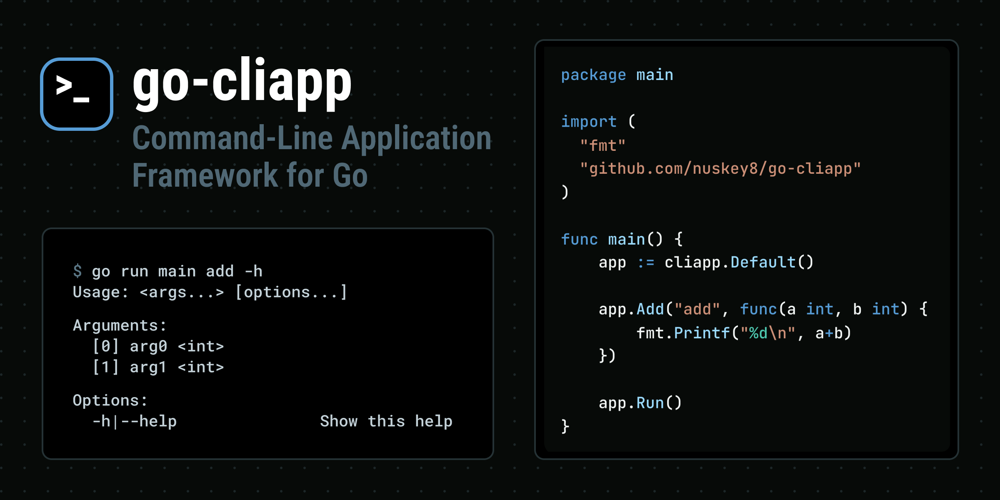

# go-cliapp



go-cliappは、Go言語でコマンドラインアプリケーションを作成するためのフレームワークです。

[English]((./README.md)) | 日本語

## Why go-cliapp?

go-cliappは他のGo向けのCLIライブラリとは異なり、多くのWebフレームワークで見られるRouting形式のAPIを採用しています。これによって記述するコードが大幅に簡略化されるため、開発やメンテナンスが容易になります。

例として、渡された数字2つから足し算を行うCLIツールを[spf13/cobra](https://github.com/spf13/cobra)、[urfave/cli](https://github.com/urfave/cli)、go-cliappで実装してみます。

<details>

<summary>spf13/cobra</summary>

```go
package main

import (
    "fmt"
    "os"
    "strconv"

    "github.com/spf13/cobra"
)

func main() {
    var rootCmd = &cobra.Command{}

    var addCmd = &cobra.Command{
        Use:   "add [num1] [num2]",
        Short: "Add two numbers",
        Args:  cobra.ExactArgs(2),
        Run: func(cmd *cobra.Command, args []string) {
            num1, err1 := strconv.Atoi(args[0])
            num2, err2 := strconv.Atoi(args[1])
            if err1 != nil || err2 != nil {
                fmt.Println("Please provide two valid integers.")
                return
            }
            fmt.Printf("Result: %d\n", num1+num2)
        },
    }

    rootCmd.AddCommand(addCmd, subCmd)

    if err := rootCmd.Execute(); err != nil {
        fmt.Println(err)
        os.Exit(1)
    }
}
```

</details>

<details>

<summary>urfave/cli</summary>

```go
package main

import (
	"context"
	"fmt"
	"os"
	"strconv"

	"github.com/urfave/cli/v3"
)

func main() {
    cmd := cli.Command{
		Name:  "add",
		Usage: "Add two integers",
		Action: func(ctx context.Context, cmd *cli.Command) error {
			if cmd.Args().Len() != 2 {
				return fmt.Errorf("please provide exactly two integers")
			}

			num1, err1 := strconv.Atoi(cmd.Args().Get(0))
			num2, err2 := strconv.Atoi(cmd.Args().Get(1))
			if err1 != nil || err2 != nil {
				return fmt.Errorf("please provide valid integers")
			}

			fmt.Printf("Result: %d\n", num1+num2)
			return nil
		},
	}

    err := cmd.Run(context.Background(), os.Args)
    if err != nil {
        fmt.Println(err)
    }
}
```

</details>

<details>

<summary>go-cliapp</summary>

```go
package main

import (
	"fmt"

	"github.com/nuskey8/go-cliapp"
)

func main() {
	app := cliapp.Default()

	app.Add("add", "Add two integers", func(num1 int, num2 int) {
		fmt.Printf("Result: %d\n", num1+num2)
	})

	app.Run()
}
```

</details>

見ての通り、はるかにシンプルなコードで同等の内容を記述できます。

また、それだけでなくgo-cliappは多くの強力な機能を備えています。

* サブコマンドのサポート
* human-friendlyなhelpの自動生成
* structタグを用いた高度なマッピング
* フラグの解析
* ショートオプション(`-o`など)のサポート
* ログ出力先の変更
* コマンド引数のカスタマイズ
* エラーハンドリング
* 標準ライブラリ以外の依存なし

## クイックスタート

`cliapp.Default()`から`App`を作成し、`Add()`でコマンドを追加、`Run()`で実行を行います。go-cliappは渡された関数のシグネチャを解析し、動的にコマンドを生成します。

```go
package main

import (
	"fmt"

	"github.com/nuskey8/go-cliapp"
)

func main() {
	app := cliapp.Default()

	app.Add("echo", func(msg string) {
		fmt.Println(msg)
	})

	app.Run()
}
```

そして以下を実行します。

```
$ go run main echo hello
hello
```

`-h`または`--help`を追加することで、生成されたヘルプメッセージを確認できます。

```
$ go run main echo -h
Usage:
  echo <args...>

Arguments:
  [0] arg0 <string>

Options:
  -h|--help               Show this help
```

引数は関数のシグネチャに基づいて自動でバリデーションされ、引数の数や型が異なる場合にはエラーが表示されます。

```go
app.Add("add", func(num1 int, num2 int) {
    fmt.Printf("Result: %d\n", num1+num2)
})
```

```
$ go run main add 1
wrong number of arguments for add: want 2, got 1

$ go run main add 1 hello
failed to parse arg 2 for add: strconv.Atoi: parsing "hello": invalid syntax
```

## コマンドの説明

`app.Add()`の第二引数にコマンドの説明を追加することも可能です。

```go
app.Add("add", "Add two numbers", func(num1 int, num2 int) {
    fmt.Printf("Result: %d\n", num1+num2)
})
```

## サブコマンド

コマンド名を空白で区切ることでサブコマンドを作成できます。

```go
app.Add("foo", func() {
    fmt.Println("Foo")
})

app.Add("foo bar", func() {
    fmt.Println("Foo Bar")
})
```

## エラーハンドリング

コマンドに渡す関数は`error`を返すことが可能です。デフォルトでは、コマンドが`error`を返した場合は`os.Exit(1)`でプロセスを終了します。

```go
app.Add("error", func() error {
    errors.New("somthing wrong!")
})
```

## structへのマッピング

コマンドが複雑なシグネチャを持つ場合や、フラグなどをサポートしたい場合は`struct`として引数を受け取ることができます。

```go
// 省略

type CreateTextArgs struct {
	Input  string 
	Output string 
}

func main() {
	app := cliapp.Default()

	app.Add("newtxt", "Create a text file from input", func(args *CreateTextArgs) error {
		if args == nil {
			return errors.New("missing args")
		}

		outPath := "out.txt"
		if args.Output != nil {
			outPath = *args.Output
		}

		f, err := os.Create(outPath)
		if err != nil {
			return err
		}
		defer f.Close()

		_, err = f.WriteString(args.Input)
		if err != nil {
			return err
		}

		return nil
	})

	app.Run()
}
```

```
$ go run main newtxt -h
Create a text file from input

Usage:
  newtxt [options...]

Options:
  -h|--help               Show this help
  --input <string>    
  --output <string> 
   
$ go run main newtxt --input hello --output hello.txt
```

サポートされる構造体の型は関数の引数として受け取る場合と同じです。ただし、`bool`型の場合はフラグとして解釈されます。

フィールドの型をポインタにすることで、オプションを省略可能にすることができます。

```go
type CreateTextArgs struct {
	Input  string 
	Output *string  // 省略可能なオプション
}
```

また、フィールドにタグを追加することで、オプションのカスタマイズを行うことができます。

```go
type CreateTextArgs struct {
	Input  string  `arg:"0" help:"input file path"`
	Output *string `short:"-o" help:"output file path"`
}
```

これは以下のような形で利用できます。

```
$ go run main newtxt -h
Create a text file from input

Usage:
  newtxt <args...> [options...]

Arguments:
  [0] input file path

Options:
  -h|--help               Show this help
  -o|--output <string>    output file path
```

サポートされるタグは以下の通りです。

| タグ名  | 例                              | 説明                                                                                               |
| ------- | ------------------------------- | -------------------------------------------------------------------------------------------------- |
| `long`  | `` `long:"--output"` ``         | ロングオプションの名前を指定します。省略した場合は\[`--` + フィールド名(kebab-case)\]になります    |
| `short` | `` `short:"-o"` ``              | ショートオプションの名前を指定します。                                                             |
| `help`  | `` `help:"output file path"` `` | helpオプションで表示される引数の説明を指定します。                                                 |
| `arg`   | `` `arg:"0"` ``                 | フィールドをオプションではなく、引数として扱うように変更します。値を渡すことで位置を指定できます。 |

## cliapp.Options

`cliapp.New()`を用いることで、`App`自体の挙動をカスタマイズできます。

```go
app := cliapp.New(cliapp.Options{
    ExitOnError: true,      // trueの場合はエラー時にos.Exit(1)を呼ぶ
    Log:         io.Stdout, // ログの出力先
    LogError:    io.Stderr, // エラーの出力先
})
```

## カスタムコマンド引数

指定がない場合はgo-cliappは`os.Args()[1:]`を解析しますが、手動で`Run()`に引数を渡すことも可能です。

```go
app.Run("foo", "bar")
```

## ライセンス

このライブラリは[MIT License](./LICENSE)の下で公開されています。